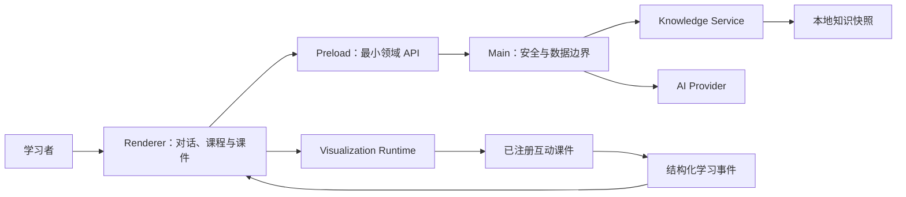

# AiStu

> 把“好像懂了”，变成真正看得见、能操作、可验证的理解。

AiStu 是面向计算机学习的桌面端 AI 教学环境。它不只回答问题，而是先定位
学习者卡住的环节，再从可靠知识、合适解释和经过审查的互动课件中组织一条
教学路径，让预测、错误与重试成为后续教学的依据。

## 为什么做 AiStu

这个项目始于一个真实的学生问题：学习计算机网络、计算机组成原理和数据结构时，
书上的定义往往是正确的，但状态变化、执行顺序和抽象结构仅靠文字很难形成稳定的
心智模型。

普通聊天式 AI 可以快速生成一段答案，却仍然存在三个缺口：

- 同一个问题被反复重新回答，高质量解释和教学设计难以复用；
- 用户是否真的理解，通常只能靠一句“懂了”判断；
- 抽象过程缺少可操作的呈现，预测、错误和重试也很少进入下一轮教学。

AiStu 把一次问答改造成一条完整教学闭环：

```text
提出具体困惑
→ AI 诊断卡点并检索可靠知识
→ 选择解释方式与已注册课件
→ 用户确认后观察、预测或操作
→ 记录结构化学习证据
→ 回到同一对话继续纠错、迁移与复盘
```

## 核心能力

| 能力 | 当前实现 |
| --- | --- |
| AI 对话诊断 | 多会话、流式回答、停止、重试、快捷引导和本地持久化 |
| 可靠知识检索 | Main-only 本地检索、可验证引用、无匹配时明确降级 |
| 自适应讲解 | 根据具体困惑选择定义、类比、流程、对比、练习或纠错 |
| 互动课件 | 10 项已完成独立教学审查的课件，支持步骤、预测、重试和 reduced-motion |
| 学习证据 | 记录有效学习时长、知识接触、课件完成、预测结果、错题与跨会话复盘 |
| 课程学习 | 408 数据结构 7 个模块、122 个原子知识点、搜索、专项会话和思维导图 |
| 社区共建 | 知识讨论、题库投稿、学校分区、来源记录和审核状态 |
| 桌面运行时 | Electron 主对话窗口与独立课件窗口，保持会话、草稿和学习状态连续 |

## 不只是“聊天框 + 动画”

| 普通聊天式 AI | AiStu |
| --- | --- |
| 每次重新生成一段答案 | 复用稳定知识和经过审查的课件 |
| 长文看完即结束 | 通过预测、操作、纠错和复盘继续教学 |
| 页面或动画只是展示 | 可视化承担状态变化、流程和理解检测 |
| AI 可以自由组织输出 | AI 只能选择注册资源并生成通过 Schema 的受限数据 |
| “看过”容易被当作“学会” | 学习足迹只记录真实参与、知识接触和练习证据 |
| 社区内容与事实容易混合 | 标准知识、社区贡献、用户状态和会话状态分域保存 |

## 产品流程

### 从真实困惑开始

AI 先用具体例子定位卡点，再通过少量可直接点击的选项推动学习，而不是一次输出整章
内容。

### 把抽象过程变成可操作课件

课件以独立桌面窗口运行。用户可以推进步骤、观察状态映射、完成预测，并随时返回原
对话。

### 从课程目录进入知识结构

408 数据结构课程提供模块导航、标准定义、搜索、思维导图和专项学习入口。

### 让学习经验成为可追溯的共建内容

学习者可以围绕知识点发起讨论或投稿题库；社区内容保留来源和审核状态，不会自动
改写标准知识库。

## 当前规模

- 10 项注册互动课件：递归调用栈、ArrayStack、ArrayQueue、DualArrayDeque、
  二叉树遍历、图遍历、折半查找、AVL 旋转、KMP 和快速排序划分；
- 408 数据结构 7 个模块、122 个原子知识点；
- 676 个可打包、可校验的本地知识 chunks；
- 全国 8 类考试与对应科目目录；
- 多会话、课程专项、学习足迹、错题记录和跨会话复盘；
- macOS arm64 `.app`、`.dmg` 与 `.zip` 构建和验收流程。

## 运行模型

AiStu 不执行 AI 临时生成的 React、JavaScript、HTML 或 CSS。当前教学场景由
三部分组成：

```text
已审查的本地 React 课件
+ 经过 Zod 校验的场景数据或受限补丁
+ 当前会话中的学习上下文
= 可控、可复用的互动教学场景
```

任意时刻只有一个活动课件。AI 首先在对话中提出建议，只有用户明确确认后才会打开；
相同课件可以受限更新，不同课件会原子替换。

## 架构



- Main 管理窗口、安全策略、AI Provider、知识文件、持久化与 IPC；
- Preload 只暴露最小、强类型的领域 API；
- Renderer 只负责 React UI 和可序列化状态；
- 跨进程输入、AI 命令、课件场景和学习事件均经过共享 Schema 校验；
- Electron 保持 `nodeIntegration: false`、`contextIsolation: true` 和
  `sandbox: true`。

完整技术边界见 [系统架构](docs/ARCHITECTURE.md)。

## 快速开始

### 环境要求

- Node.js `22.21.0` 或 `24.14+`
- pnpm `11.9.0`

### 启动开发应用

```bash
pnpm install
cp .env.example .env
pnpm dev
```

只需在项目根目录的 `.env` 中填入 DeepSeek API Key：

```dotenv
AISTU_AI_PROVIDER=deepseek
DEEPSEEK_API_KEY=在这里填写你的_API_Key
DEEPSEEK_MODEL=deepseek-v4-flash
```

密钥只由 Electron Main 读取，不会进入 Renderer、应用持久化数据或 Git。需要更高
质量时可将模型改为 `deepseek-v4-pro`；本地已经登录 Codex CLI 时也可以把 Provider
改为 `codex`。

### 离线演示模式

无需外部模型或网络即可复现确定性的黄金教学流程：

```bash
AISTU_AI_PROVIDER=demo pnpm dev
```

知识库及其固定来源、authoring、审查和可复现流水线保存在
`content/ods-material/`；发布包只携带经过同步与校验的运行时快照。

## 质量与发布

常规质量门：

```bash
pnpm typecheck
pnpm lint
pnpm docs:check
pnpm test
pnpm test:e2e
pnpm build
```

macOS 完整验收：

```bash
pnpm acceptance:mac
```

该流程覆盖知识校验、文档、类型、lint、Vitest、Electron Playwright、macOS
打包、包完整性和启动 smoke。详细步骤见
[测试指南](docs/guides/TESTING.md)与[发布指南](docs/guides/RELEASE.md)。

## 项目状态

0.1.0 桌面教学闭环已经完成。当前进入 0.2 阶段，优先提升日常使用可靠性、
学习延续和真实教学质量。

准确的完成度、风险和最近验证记录以[当前路线图](docs/ROADMAP.md)为准。

## 仓库结构

```text
apps/desktop/                   Electron 主应用
packages/contracts/             跨进程协议与 Zod Schema
packages/knowledge-runtime/     本地知识检索纯逻辑
packages/tutor-runtime/         Tutor 命令与教学编排
packages/visualization-runtime/ 注册表、session 与 patch 运行时
packages/lessons/               已注册 React 课件
packages/ui/                    共享 UI 原语
content/ods-material/            标准知识、来源、审查与维护流水线
docs/                           产品、架构、开发和交付文档
e2e/                            Electron Playwright 场景
scripts/                        快照、打包和验收脚本
```

## 文档

- [产品方向](docs/PRODUCT_DIRECTION.md)
- [当前开发范围](docs/CURRENT_SCOPE.md)
- [系统架构](docs/ARCHITECTURE.md)
- [当前路线图](docs/ROADMAP.md)
- [课件开发指南](docs/guides/LESSON_DEVELOPMENT.md)
- [标准知识库指南](content/ods-material/knowledge_base/README.md)
