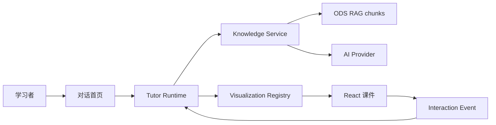
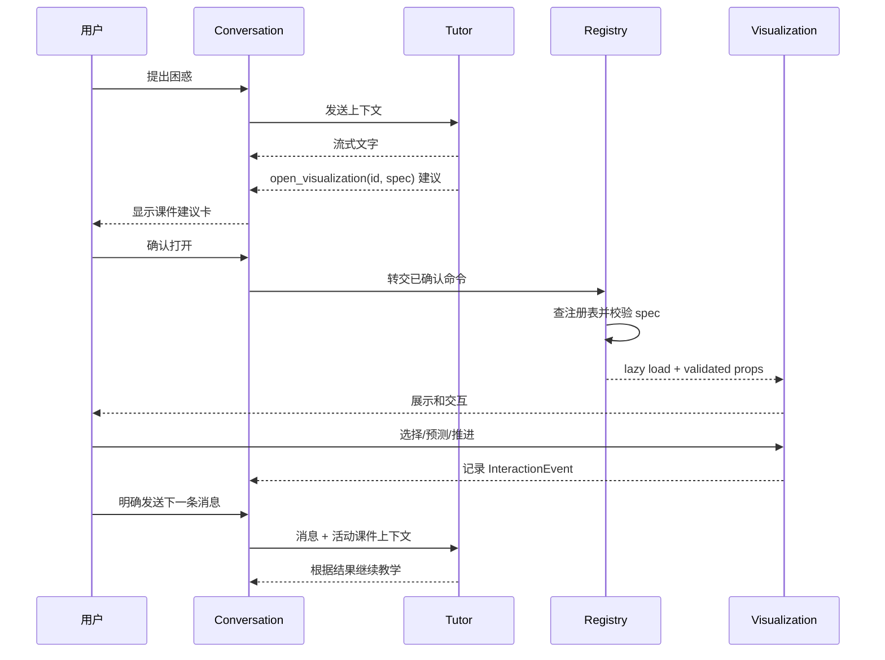
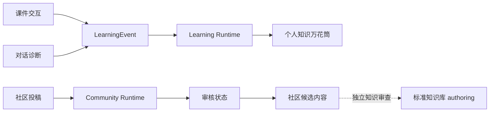

# Kaleidoscope 桌面架构

## 1. 架构目标

架构需要支持：

- Electron 安全隔离；
- AI 流式对话；
- 已有 React 课件复用；
- AI 通过结构化数据调整课件；
- 任意时刻只维护一个活动可视化页面；
- 对话与可视化之间的教学事件闭环；
- 与标准知识库稳定关联；
- 本地检索、受约束知识注入和可验证引用；
- 后续接入用户学习状态时不破坏当前边界。

## 2. 系统上下文



当前 MVP 已接入本地最小 Knowledge Service。它在 Main 中校验并检索 ODS RAG
chunks，把少量候选知识注入 Provider，再校验模型返回的引用是否属于本轮候选集。

## 3. Monorepo 结构

```text
Kaleidoscope/
├── apps/
│   └── desktop/
│       ├── src/
│       │   ├── main/
│       │   ├── preload/
│       │   └── renderer/
│       ├── electron.vite.config.ts
│       └── electron-builder.yml
├── packages/
│   ├── contracts/
│   ├── knowledge-runtime/
│   ├── learning-runtime/        # 黑客松后续阶段创建
│   ├── community-runtime/       # 黑客松后续阶段创建
│   ├── tutor-runtime/
│   ├── visualization-runtime/
│   ├── lessons/
│   │   ├── call-stack/
│   │   ├── arraystack-insertion/
│   │   ├── arrayqueue-representation/
│   │   └── dualarraydeque-balance/
│   └── ui/
├── docs/
├── AGENTS.md
├── package.json
├── pnpm-lock.yaml
└── pnpm-workspace.yaml
```

`call-stack-visualizer` 在迁移验收前保留为参考。

黑客松开发运行时以本机 Node.js 22.21.0 为基线；Codex 工作区允许使用已验证的
Node.js 24.14.x 工具运行时。workspace 建立时提交 `.node-version`，
`package.json#engines`、`package.json#packageManager` 与 `pnpm-lock.yaml`，并锁定
已验证兼容的 Electron、electron-vite、Vite 和测试工具版本。

## 4. Electron 分层

### Main

负责：

- BrowserWindow；
- Electron 安全配置；
- AI Provider 请求和凭据；
- 流式响应生命周期；
- 本地持久化；
- 受控知识资源读取；
- IPC handlers；
- 应用错误和日志。

Main 不负责 React 渲染或课件动画。

### Preload

负责：

- contextBridge；
- 固定领域 API；
- 类型化 IPC；
- 流式事件订阅；
- 取消订阅；
- 隐藏 ipcRenderer。

### Renderer

负责：

- 对话首页；
- 可视化容器；
- React 课件；
- Renderer 状态；
- 结构化课件交互；
- 安全 Markdown 展示；
- 加载、错误和降级 UI。

对话视口有两个明确模式：无消息时渲染固定单屏空状态并使用
`overflow: hidden`；出现用户或 AI 消息后切换为消息列表并使用
`overflow-y: auto`。输入框始终位于视口之外的固定底部区域，空状态不能依靠内容
高度“碰巧不滚动”。

Renderer 不直接拥有 Provider 密钥、文件系统权限或动态代码执行能力。

## 5. Package 边界

### contracts

保存：

- IPC 通道；
- Zod 请求和响应；
- 流式事件类型；
- Conversation 类型；
- TutorCommand；
- VisualizationSessionSpec 外层协议；
- VisualizationInteractionEvent；
- 错误码；
- `window.kaleidoscope` API 类型。

### tutor-runtime

负责纯教学编排逻辑：

- 处理 AI 流式事件；
- 识别结构化 TutorCommand；
- 请求可视化；
- 接收课件交互事件；
- 把事件组织为后续 Tutor 上下文；
- 不依赖具体 React 课件。

AI Provider 网络请求在 main；可测试的事件归一化和状态转换可以放在
`tutor-runtime`。

### knowledge-runtime

负责可测试、无 Electron 依赖的本地检索逻辑：

- 解析并校验知识库 JSONL；
- 中文 n-gram 与英文 token 化；
- 轻量 BM25 排序；
- 按 concept 聚合核心片段和补充片段；
- 短追问使用上一轮已引用 concept 作为有限上下文。

知识文件定位、缓存与受控读取属于 Main 的 `KnowledgeService`，不在 Renderer。

### learning-runtime（后续阶段）

负责可测试、无 Electron 依赖的用户学习域逻辑：

- 结构化学习事件校验；
- 从预测、重试、完成和延迟复习证据派生知识状态；
- 个人知识万花筒节点和推荐路径的纯函数投影；
- 通过 `concept_id` 引用标准知识，不保存或改写知识事实。

初期持久化仍由 Main 的版本化 JSON 管理。学习状态不得混入 conversation store、
visualization store 或知识库 authoring 数据。

### community-runtime（后续阶段）

负责可测试、无 Electron 依赖的社区内容域逻辑：

- 结构化投稿 Schema；
- 投稿来源、版本和审核状态；
- 课程与学校分区索引；
- 待审核、已通过和已驳回状态转换；
- 社区内容与权威知识之间的明确边界。

社区投稿不能直接成为事实型回答的权威来源。只有完成独立知识审查和知识库
authoring 流程后，内容才可能进入标准知识域。

### visualization-runtime

负责：

- 静态注册表；
- visualization ID 查找；
- session spec 校验；
- 页面补丁校验与应用；
- lazy loading；
- 默认场景；
- 错误边界协议；
- 交互事件协议；
- 单一活动可视化状态生命周期；
- session revision 管理。

### lessons/call-stack

负责：

- 现有调用栈课件；
- 静态步骤；
- 可调整参数 Schema；
- 课件专属 props；
- 交互事件；
- 回归测试。

### lessons/ODS 首批资源

`arraystack-insertion`、`arrayqueue-representation` 和
`dualarraydeque-balance` 分别负责逐槽移动、循环下标映射与批量重排。每个包独立
拥有场景 Schema、纯函数步骤生成、受限 patch、React 课件和算法测试；共享
`packages/ui` 的可访问步骤框架，不复制桌面容器。

### ui

保存对话、overlay、按钮、错误状态等通用 UI，不保存具体知识事实。

## 6. AI Provider 边界

Renderer 不直接持有 API Key。

建议流程：

```text
Renderer
→ preload.chat.send(validated request)
→ main KnowledgeService 检索候选 chunks
→ main AI Provider（带受约束知识上下文）
→ main 解析/归一化 Provider stream
→ 校验引用只来自本轮候选集合
→ preload scoped events
→ Renderer
```

Provider 抽象至少区分：

- start；
- delta；
- structured command；
- complete；
- error；
- cancelled。

不要让 Renderer 依赖特定厂商原始流事件。

Provider 配置和凭据由 main 管理。日志不得记录密钥或完整敏感请求。

当前开发期路由：

```text
Renderer
→ typed IPC
→ main KnowledgeService / local BM25
→ main CodexTutorProvider
→ codex exec（空临时目录、read-only、ephemeral）
→ JSON Schema 输出
→ Zod 与 citation allowlist 校验
→ TutorPlan / TutorCommand
```

本机 Codex 只作为开发期代答方案，不是 Renderer 能调用的通用 shell。Main 使用
固定参数启动已配置的 Codex CLI，不接受用户提供的命令、工作目录或 flags，不把
Main 的完整环境变量传给子进程，并显式禁用 shell、浏览器、网页搜索、MCP/插件和
多 Agent 工具。ChatGPT 网页只能人工转接，不抓取网页、复用 Cookie 或依赖页面
DOM。

正式商业 Provider 目标为 DeepSeek API。接入时必须继续复用同一流事件与
TutorCommand Schema；Renderer 不得感知 DeepSeek 原始事件或密钥。

## 7. TutorCommand

AI 文字和应用控制命令必须分开。

示例：

```ts
type TutorCommand =
  | {
      type: "open_visualization";
      visualizationId: string;
      spec: unknown;
    }
  | {
      type: "close_visualization";
    }
  | {
      type: "focus_visualization_step";
      stepId: string;
    }
  | {
      type: "patch_visualization";
      patch: unknown;
    };
```

TutorCommand 必须：

- 通过 Zod；
- 限制类型；
- 不能包含代码；
- 不能包含组件路径；
- 不能包含任意 URL；
- 不能直接改变文件或系统状态。

不支持的命令应被拒绝，并允许 Tutor 回退为文字讲解。

可视化命令遵循单实例规则：

- Renderer 收到 `open_visualization` 后先保存为临时 UI 建议，不立即创建 session；
- 只有用户点击确认，命令才进入 Registry 校验并创建或替换 session；
- 用户拒绝建议时直接丢弃临时命令；
- visualization ID 相同时，后续调整通过 `patch_visualization` 更新当前 session；
- visualization ID 不同时，`open_visualization` 原子替换当前 session；
- 不在后台同时保留多个可视化实例。

## 8. 可视化数据流



用户继续表达困惑时，Tutor 可以发送 `patch_visualization`。运行时先校验 session ID、
visualization ID、base revision 和补丁操作，再在同一个 React 页面中生成下一
revision；校验失败时保持当前页面不变并回退为文字说明。

## 9. 可视化注册表

```ts
interface VisualizationRegistration<TSpec, TEvent> {
  id: string;
  conceptIds: string[];
  version: number;
  status: "draft" | "review_pending" | "reviewed";
  specSchema: ZodType<TSpec>;
  defaultSpec: TSpec;
  load: () => Promise<VisualizationModule<TSpec, TEvent>>;
}
```

约束：

- 注册表由本地源码静态维护；
- AI 不能新增注册项；
- AI 不能提供 import 路径；
- spec 必须先校验后传给组件；
- Registry 必须支持默认场景；
- Registry 完整性有自动测试；
- reviewed 状态来自内容/教学审查，不由生成该组件的同一 Agent 自行宣布。

## 10. VisualizationSessionSpec

建议由通用外层和课件专属场景组成：

```ts
interface VisualizationSessionSpec<TScenario> {
  visualizationId: string;
  visualizationVersion: number;
  teachingGoal: string;
  initialStep?: number;
  tutorNotes?: TutorNoteInput[];
  pauses?: PredictionPause[];
  scenario: TScenario;
}
```

通用限制：

- `teachingGoal` 长度上限；
- notes 数量和单条长度上限；
- pauses 数量上限；
- initialStep 范围；
- version 必须兼容；
- `additionalProperties: false`；
- scenario 使用对应课件 Schema。

### 10.1 VisualizationPatch

```ts
interface VisualizationPatch {
  sessionId: string;
  visualizationId: string;
  baseRevision: number;
  operations: VisualizationPatchOperation[];
}
```

补丁操作必须是各课件预先声明的判别联合，只能调整安全数据和呈现状态，例如演示
数据、允许的步骤、当前强调、高亮、TutorNote、预测暂停、预定义视图与允许的布局
参数。不得接受任意属性路径，不得包含 React、JavaScript、HTML、CSS、组件路径或
可执行内容。

每个 session 从确定的 revision 开始。只有 `baseRevision` 等于当前 revision 的
补丁可以应用；成功后 revision 递增，过期、越界或未知操作保持当前页面不变。

## 11. 调用栈课件调整边界

第一版保持现有静态步骤。

AI 可在预定义范围内选择：

- 默认演示变体；
- 初始步骤；
- 强调阶段；
- TutorNote；
- 预测暂停点；
- 总结问题。

如果未来需要不同递归深度，应由开发阶段预先实现并审查安全的场景生成器，而不是
运行时执行 AI 生成代码。

代码面板保持只读。

## 12. 对话与可视化布局

```text
Renderer Root (relative)
├── ConversationPage
└── VisualizationWorkspace (single active absolute/fixed layer)
```

要求：

- ConversationPage 保持 mounted；
- 可视化打开不清空消息；
- 不丢失输入草稿；
- 不重置滚动位置；
- 支持关闭返回；
- 可按设计保留部分对话区域可见；
- overlay 阻止不必要的点击穿透；
- 焦点在打开/关闭时正确转移；
- Escape 行为明确；
- reduced-motion 生效；
- workspace 任意时刻只渲染一个活动可视化 session；
- 相同可视化在原页面更新，不创建标签页；
- 不同可视化原子替换当前页面。

这里没有终端或 PTY。

## 13. 对话状态模型

至少区分：

```text
conversationStore
├── activeConversationId
├── conversations[0..30]
│   ├── conversationId
│   ├── messages
│   ├── draft
│   ├── activeVisualization
│   ├── createdAt
│   └── updatedAt
├── streamingState
└── lastError

visualizationStore
└── activeSession | null
    ├── sessionId
    ├── visualizationId
    ├── revision
    ├── validatedSpec
    ├── currentStep
    ├── status
    └── interactionHistory

appStore
├── currentRoute
└── UI preferences
```

AI Provider 请求生命周期由 main 管理；Renderer 保存可序列化的展示状态。
新建对话会归档当前会话并创建新的活动会话，切换历史会话时会原子恢复该会话的
消息、草稿和可视化快照。可持久化多个会话不改变“运行时任意时刻只显示一个活动
可视化”的不变量。

完整用户掌握度属于未来用户学习域，不能等同于临时 interactionHistory。

## 14. IPC 设计

建议领域 API：

```ts
interface ChatApi {
  send(input: ChatSendInput): Promise<ChatRequest>;
  cancel(input: ChatCancelInput): Promise<void>;
  onEvent(listener: (event: ChatStreamEvent) => void): () => void;
}

interface PersistenceApi {
  loadSession(): Promise<PersistedAppStateV2 | null>;
  saveSession(input: PersistedAppStateV2): Promise<void>;
}
```

禁止通用 `send`、`invoke`、任意文件和任意代码执行 API。

所有 IPC handler 除了校验参数，还必须验证 sender 来自当前受信任的应用页面。
所有订阅必须可取消；窗口关闭或请求取消后停止流事件。

MVP 持久化使用 main 管理的 v2 版本化 JSON 文件，保存在 Electron 用户数据目录，
最多保存 30 个最近会话，并在读取时经过 Zod 校验。Main 会把旧的单会话 v1 文件
迁移成 v2 返回，后续写入只使用 v2。当前不引入 SQLite；只有出现大量会话、全文
检索或复杂关系查询后再评估数据库。

后续黑客松阶段增加用户学习和社区数据时，继续通过独立的领域 Schema 与受控 Main
API 持久化。可以共享物理 JSON 文件或用户数据目录，但逻辑模型、版本和迁移必须
独立；Renderer 不能因此获得任意文件接口。

## 14.1 多视角知识边界

多视角不是复制或改写标准知识。标准知识对象仍保存稳定事实；视角层只声明允许的
表达方式和呈现内容，例如定义、直觉、流程、对比、做题、易错和可视化。

AI 只能选择注册过的视角 ID、顺序和安全文本字段。视角内容来自经过校验的知识数据
或受控 Tutor 输出，不能包含 HTML、组件路径、源码或任意属性路径。

## 14.2 用户学习与社区数据流



个人学习状态和社区内容都可以引用 `concept_id`，但都不能反向修改标准定义。社区
审核通过也不等于知识审查通过。

## 15. 知识库接入

标准知识库：

```text
/Users/umico/Documents/ods-material/knowledge_base
```

该内容域使用 version 2 多课程 taxonomy。当前运行时索引同时包含
`open-data-structures` 课程和 `cs408-data-structures` 考纲指南知识岛；知识点以
来源命名空间区分（当前为 `ods-` 与 `cs408-`），但统一通过相同 Schema、关系图、
审查状态和 RAG 派生流程。外部报告先保存来源指纹与结构化 source records，报告内
不可复用的临时检索标记不会被当作可验证 URL。新增内容在独立审查前保持
`review_pending`。

当前未知 concept：

```text
用户问题
→ Main 加载并校验 rag/chunks.jsonl
→ 本地关键词/BM25 检索
→ 最多 3 个 concept、6 个 chunks
→ Provider 仅基于候选知识回答
→ 返回 citation chunk IDs
→ citation allowlist 校验
→ Renderer 显示知识点标题与章节
→ Tutor 编排
```

短追问会有限提高上一轮已引用 concept 的检索权重，但不会绕过相关性阈值。知识库
无匹配时返回 `not_found`，文件缺失或解析失败时返回 `unavailable`；两种状态都不会
阻塞普通对话，也不能伪造引用。

知识 chunks 仍按不可信参考数据处理：用明确边界注入 Prompt，不服从片段内的指令；
AI 输出引用必须属于本轮检索集合。模型不能指定知识库路径、读取任意文件或绕过
Main 的校验。

Renderer 不直接扫描知识库文件系统。由 main 或受控本地服务读取和校验。
当前实现不依赖 embedding、向量数据库或大型 RAG 框架；知识规模和召回需求增长后
再评估替换检索器，contracts 与 Provider 边界保持不变。

开发环境优先读取独立 `ods-material/knowledge_base`。macOS 发布包只携带
`rag/chunks.jsonl` 的运行时快照，放在
`Resources/knowledge_base/rag/chunks.jsonl`；authoring、审查报告、Prompt 和维护
脚本不得进入桌面包。快照通过 `pnpm sync:knowledge` 从权威知识域刷新，并在打包前
校验。

## 16. 安全模型

强制：

```ts
nodeIntegration: false
contextIsolation: true
sandbox: true
```

同时要求：

- 严格 CSP；
- 拦截导航和新窗口；
- 校验所有 IPC sender；
- 默认拒绝未明确允许的权限请求；
- 开发环境保留 electron-vite HMR；`ELECTRON_RENDERER_URL` 仅在
  `!app.isPackaged` 时生效，打包版始终使用应用自有协议加载 Renderer；
- 不加载 AI 指定远程脚本；
- 不执行 AI 输出；
- 不用未清洗 HTML；
- Markdown 限制协议和标签；
- IPC 校验长度、枚举和 ID；
- Provider 凭据仅在 main；
- AI 输出只作为数据；
- 错误日志不泄露凭据。

## 17. 测试策略

### Vitest

- contracts；
- TutorCommand；
- session spec；
- registry；
- conversation reducer/store；
- visualization store；
- AI stream 归一化；
- RAG JSONL 解析、中文检索和无匹配降级；
- grounded 引用映射和伪造 chunk ID 拒绝；
- 非法 spec 降级；
- interaction event。

### 组件测试

- 消息流；
- 输入框；
- 停止与重试；
- overlay 打开关闭；
- 对话保持 mounted；
- 调用栈课件迁移；
- reduced-motion；
- 错误边界。

### Playwright Electron

Playwright 的 Electron 自动化目前属于实验能力，因此只承担关键黄金流程和 smoke
test，不作为唯一安全验证手段。contracts、状态转换和安全策略仍由 Vitest、静态
检查及打包产物人工/自动 smoke test 共同覆盖。

- 应用启动；
- 发送消息；
- 流式回答；
- AI 提出可视化建议；
- 用户确认后打开、拒绝后保持关闭；
- 用户完成交互；
- 结果结构化记录且不自动生成用户消息；
- 关闭可视化；
- 会话恢复；
- 安全 smoke test。

## 18. 架构不变量

- 首页是对话；
- 可视化基于已有组件；
- AI 只输出受约束数据；
- 新课件必须经过用户确认才能打开；
- 课件事件不得伪装成用户消息自动发送；
- 用户不能编辑课件代码；
- 没有终端；
- Renderer 无 Node；
- 凭据只在 main；
- preload 只暴露最小 API；
- IPC 和 AI spec 全部校验；
- IPC sender 全部校验；
- 对话与可视化状态分离；
- 用户学习状态与 conversation、visualization 及知识内容域分离；
- 社区投稿保留来源和审核状态，不能自动进入权威知识域；
- 可视化关闭后原会话保持；
- 知识事实不包含用户状态；
- 可视化代码不写入知识库；
- 未审查资源不能标记 reviewed；
- Electron Fuses 在发布打包阶段完成配置与验证。
