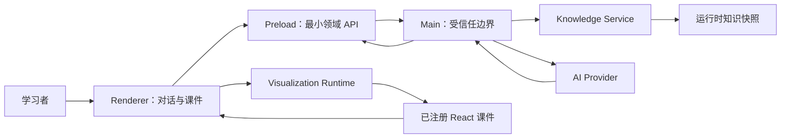
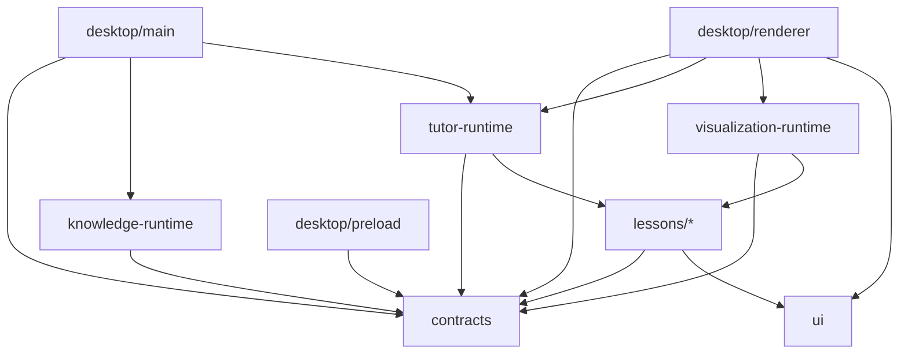
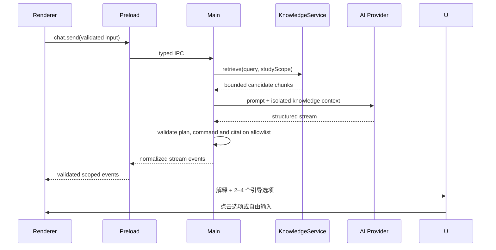
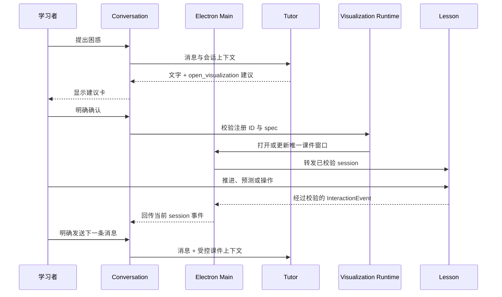
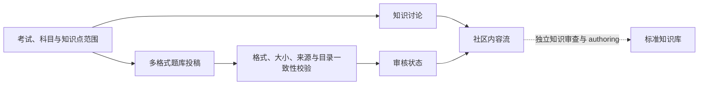

# Kaleidoscope 桌面架构

> 状态：当前架构基线
> 最近复核：2026-07-25
> 本文回答：系统如何分层、数据怎样流动、状态归谁管理。产品范围见
> [`MVP_SCOPE.md`](MVP_SCOPE.md)。

## 1. 架构目标与不变量

架构需要同时支持安全的 Electron 隔离、连续 AI 对话、本地知识检索、可审核课件与
结构化教学事件。

不可违反的不变量：

- 首页是对话，课件在独立窗口中提供临时 workspace；
- 新课件必须经过用户确认；
- 任意时刻只有一个活动可视化 session；
- AI 输出只作为数据，不作为代码；
- 课件只从本地静态注册表加载；
- Renderer 无 Node、文件系统、进程和凭据权限；
- IPC 输入和 AI 输出均通过共享 Schema；
- 课件事件不伪装成用户消息；
- 知识事实、社区内容、用户学习状态和会话状态分域；
- 未审核内容与课件不能冒充权威或 `reviewed`。

长期权衡记录在 [`decisions/`](decisions/)。

## 2. 系统上下文



Main 是本地受信任边界。Provider、知识文件、持久化、Electron 权限与系统能力不能
绕过 Main 进入 Renderer。

## 3. 仓库结构与依赖方向

```text
apps/desktop/
├── src/main/                   窗口、安全、Provider、知识、持久化、IPC
├── src/preload/                contextBridge 与领域 API
├── src/renderer/               React 页面、stores 与桌面交互
└── resources/knowledge_base/   打包运行时知识快照

content/ods-material/
├── corpus/                     固定来源的确定性结构化语料
└── knowledge_base/             标准知识 authoring、审查与派生流水线

packages/
├── contracts/                  跨进程 Schema 与类型
├── knowledge-runtime/          无 Electron 的检索纯逻辑
├── tutor-runtime/              Tutor 命令与教学编排
├── visualization-runtime/      注册表、session、patch 与加载
├── lessons/                    课件包
└── ui/                         共享 UI 原语

e2e/                            Electron Playwright 场景
scripts/                        快照、打包、完整性与 smoke 脚本
```

允许的主要依赖方向：



纯运行时包不依赖 Electron。课件不负责创建桌面窗口、路由或持久化。

## 4. Electron 进程边界

### 4.1 Main

负责：

- `BrowserWindow` 生命周期与安全配置；
- 应用自有协议、CSP、导航、新窗口和权限策略；
- AI Provider 选择、请求、取消、输出归一化与凭据；
- 受控知识快照定位、读取、缓存与课程装配；
- 版本化本地持久化和迁移；
- IPC handler、sender 校验、日志与错误。

Main 不渲染 React，不维护课件动画，也不接受 Renderer 提供的命令行、任意路径或
任意 Provider 参数。

### 4.2 Preload

负责：

- 用 `contextBridge` 暴露 `window.kaleidoscope`；
- 在进出 IPC 前使用共享 Schema 校验；
- 把流式事件转换为可取消订阅；
- 隐藏 `ipcRenderer` 与 Electron 原始事件。

当前领域 API 只有：

```text
window.kaleidoscope
├── chat
├── knowledge
├── persistence
└── visualizationWindow
```

禁止通用 `send`、`invoke`、任意文件、任意 shell 和任意代码执行 API。

### 4.3 Renderer

负责：

- 对话、商店、课程、社区与导航 UI；
- 对话消息、输入、流式和错误状态；
- 安全 Markdown 语义渲染；
- 课件建议卡与用户确认；
- 独立课件窗口中的单一可视化 workspace；
- React 课件与结构化互动；
- 可序列化的 Zustand UI 状态。

Renderer 不能读取知识文件、Provider 密钥、完整环境变量或 Node 模块。

## 5. Package 职责

| Package | 权威职责 | 不负责 |
| --- | --- | --- |
| `contracts` | IPC 通道、Zod 请求/响应、流事件、持久化、知识、TutorCommand 与课件事件类型 | React UI、文件读取、Provider 实现 |
| `knowledge-runtime` | JSONL 解析、token 化、BM25、concept 聚合与有限追问上下文 | 文件定位、Electron、UI |
| `tutor-runtime` | Tutor 计划、命令归一化、学习视角、Demo 场景与可测试编排 | 网络请求、React 课件 |
| `visualization-runtime` | 静态注册表、spec/patch 校验、session revision、lazy load 与默认场景 | 具体教学内容、桌面布局 |
| `lessons/*` | 课件专属 Schema、步骤模型、React 组件、预测与算法测试 | AI 调用、窗口、任意动态代码 |
| `ui` | 可复用 UI 与课件交互原语 | 标准知识事实、领域持久化 |

课程目录目前由 Main 从已校验 core chunks 装配。全国考试目录与社区 Schema 当前在
Desktop Renderer 内共享；将来跨端或进入 Main 持久化时再抽出
`community-runtime`，不提前制造空包。

商店的 `selectedExamId`、搜索词与演示用课程库选择属于 Renderer 临时 UI 状态。
搜索只对经过 Schema 校验的本地考试目录字段和嵌套科目字段做同步过滤，不经过
IPC、不访问文件系统，也不写入持久化。考试卡片是非交互语义容器，只有独立“进入”
按钮修改 `selectedExamId`，避免整卡误触和隐藏导航行为。未接入学习内容的课程可在
当前商店视图标记为已添加，但不会获得课程路由或“开始学习”能力。

## 6. 关键数据流

### 6.1 对话、检索与引用



检索最多选择少量 concept 和 chunks。短追问可以有限提高上轮引用 concept 的权重，
但不能绕过相关性阈值。知识 chunks 使用明确边界注入 Prompt，片段中的指令不具备
执行权。

Provider 返回的 citation 必须属于本轮候选：

- 合法候选：映射为结构化来源元数据；
- 无匹配：`not_found`；
- 文件缺失或解析失败：`unavailable`；
- 伪造 ID：拒绝该输出或安全降级。

Tutor 的 `suggestedReplies` 是受限的学习导航数据，不是可执行命令。Provider
优先保留模型给出的有限答案；普通讲解未提供选项时补充安全的继续、换比喻或小题
入口。学习者点击后，所选完整文案作为其明确发送的消息进入正常对话链路；系统不会
把后台事件或学习记录伪装成用户消息。课件建议卡已有确认与拒绝操作时，不再叠加
一组竞争性的快捷回答。

### 6.2 课件建议、确认与交互



收到 `open_visualization` 时只保存临时建议，不创建 session。用户确认后：

- 相同 visualization ID 可以建立新 session 或按协议更新当前 session；
- 不同 ID 原子替换当前 session；
- 不保留后台标签页、并排课件或可视化页面栈。

课件窗口与主窗口使用相同的 Electron 隔离和导航策略。课件窗口不能直接访问主窗口
store，只能通过 `visualizationWindow` 领域 API 获取当前 session、上报步骤与互动、
请求关闭或切换系统全屏。Main 只接受来自预期窗口的调用，并在转发前再次用共享
Schema 校验。

`patch_visualization` 必须同时匹配 `sessionId`、`visualizationId` 和
`baseRevision`。成功后 revision 加一；过期、越界和未知操作保持页面不变。

### 6.3 专项课程

专项范围是会话元数据：

```text
Conversation.studyScope
→ contracts 校验允许的 courseId
→ KnowledgeService 过滤候选 chunks
→ Tutor Prompt 声明课程边界
→ 工具列表只暴露课程内课件
```

`courseStudyProfile` 独立保存学习者主观起点，只影响初始解释深度。它不是知识事实、
用户消息或掌握证据。

### 6.4 社区投稿



话题和题库投稿分别保存，但都属于社区数据域。Renderer 只保存本地 MVP 所需的题库
文件元数据与审核演示状态，不获得任意文件系统访问能力。社区审核通过不等于知识
审查通过，讨论文本和题库均不能直接成为事实型回答的权威引用。

## 7. 核心协议

### 7.1 TutorCommand

AI 文字与应用控制命令分离。允许的命令类型由共享判别联合定义，例如：

```ts
type TutorCommand =
  | { type: "open_visualization"; visualizationId: string; spec: unknown }
  | { type: "close_visualization" }
  | { type: "focus_visualization_step"; stepId: string }
  | { type: "patch_visualization"; patch: unknown }
  | { type: "record_misconception"; topic: string; learnerStatement: string;
      correction: string; conceptId: string | null };
```

`record_misconception` 只携带误解展示文本（`conceptId` 限于本轮引用候选），由
Renderer 路由到课程学习域，不触发任何课件操作。

命令不能包含源码、组件路径、任意 URL、文件路径或系统操作。不支持的命令被拒绝，
Tutor 可以回退为文字讲解。

### 7.2 VisualizationRegistration

```ts
interface VisualizationRegistration<TSpec, TEvent> {
  id: string;
  conceptIds: string[];
  version: number;
  status: "draft" | "review_pending" | "reviewed";
  specSchema: ZodType<TSpec>;
  defaultSpec: TSpec;
  load: () => Promise<VisualizationModule<TSpec, TEvent>>;
}
```

注册表由本地 TypeScript 源码维护。AI 不能新增注册项、提供 import 路径或改变审核
状态。

### 7.3 Session 与 patch

```ts
interface VisualizationSessionSpec<TScenario> {
  visualizationId: string;
  visualizationVersion: number;
  teachingGoal: string;
  initialStep?: number;
  tutorNotes?: TutorNoteInput[];
  pauses?: PredictionPause[];
  scenario: TScenario;
}

interface VisualizationPatch {
  sessionId: string;
  visualizationId: string;
  baseRevision: number;
  operations: VisualizationPatchOperation[];
}
```

通用外层与课件专属 `scenario` 都使用严格 Schema。patch operation 是预先声明的
判别联合，不接受任意属性路径。

## 8. Renderer 状态归属

```text
conversationStore
├── activeConversationId
├── conversations[0..30]
│   ├── messages
│   ├── draft
│   ├── studyScope | null
│   └── activeVisualization snapshot
├── streamingState
└── lastError

visualizationStore
└── activeSession | null
    ├── sessionId
    ├── visualizationId
    ├── revision
    ├── validatedSpec
    ├── currentStep
    └── interactionHistory

courseProfileStore
└── per-course subjective starting profile

courseLearningStore
└── per-course engagement, evidence-backed learning footprint and mistake book

appStore
├── currentRoute
└── UI preferences

communityStore
├── local knowledge-point topics
└── question-bank submissions, attachment metadata and review state
```

可持久化多个会话和使用两个桌面窗口，不改变运行时只有一个活动课件的不变量。
`courseLearningStore` 可以跨会话聚合有效时长、学习日期、有来源知识接触、课件
完成和预测结果，并据此展示轻量成就。同一 store 还收录错题记录：预测答错（带题干
与答案快照）与对话误解（AI 经 `record_misconception` 上报），按预测点或主题去重，
跨会话重新预测正确自动标记已复盘；复盘状态只表达回顾参与。完整用户掌握度属于
未来的用户学习域，不能等同于课程自评、学习足迹或 `interactionHistory`。

## 9. 持久化

Main 管理 Electron `userData` 下的版本化 JSON：

- 读取时进行 Zod 校验；
- 已知旧版本执行显式迁移；
- 写入只使用当前版本；
- Renderer 通过最小 Persistence API 保存可序列化状态；
- 课程起步档案和课程学习足迹与 conversation 分开持久化；
- 当前规模不引入 SQLite。

出现大量会话、全文检索或复杂关系查询后再评估数据库，不能因为未来可能性提前放宽
任意文件 API。

## 10. 知识快照

权威知识库是仓库内独立的数据域和长期产品资产：

```text
content/ods-material/
├── source_snapshot/            固定的上游来源快照
├── corpus/                     可复现的结构化语料
└── knowledge_base/             authoring、审查、标准知识与派生产物
```

它与应用代码一同版本化，但仍保持知识事实、社区内容、用户状态和临时会话的数据域
隔离。`.venv`、缓存等可重建环境不得进入版本库。
完整决策见
[ADR-0004](decisions/0004-repository-owned-knowledge-assets.md)。

桌面运行时只携带：

```text
apps/desktop/resources/knowledge_base/rag/chunks.jsonl
```

开发环境默认读取仓库内权威知识库；发布包始终使用同步后的运行时快照。刷新与验证：

```bash
pnpm sync:knowledge
pnpm check:knowledge-snapshot
```

authoring 草稿、审查报告、Prompt 和知识维护脚本不得进入桌面包。Renderer 不能读取
快照路径或原始 JSONL。`KALEIDOSCOPE_KNOWLEDGE_BASE_PATH` 只作为开发与 CI 的显式
覆盖入口，正常构建不依赖仓库外路径。

## 11. AI Provider

Provider 实现在 Main，向 Renderer 暴露统一流事件：

```text
start → delta* → command* → complete
                         ↘ error / cancelled
```

当前正式网络 Provider 是 DeepSeek API：

- 项目根目录 `.env` 只由构建与 Main 进程读取；
- Key 不通过 Preload、IPC 或持久化进入 Renderer；
- 使用官方 OpenAI 兼容 Chat Completions 接口和 JSON Output；
- 模型输出仍需经过 Tutor Zod Schema、注册课件 allowlist 和知识引用 allowlist；
- 取消、超时、认证、余额、限流与服务错误统一映射为应用流事件。

本地开发仍可使用受控 Codex CLI：

- 固定参数与空临时目录；
- ephemeral、只读 sandbox；
- 不接受用户提供的命令、工作目录或 flags；
- 显式禁用 shell、浏览器、网页搜索、MCP、插件和多 Agent 工具；
- 不继承完整 Main 环境；
- 输出必须符合 Tutor JSON Schema，再经过 Zod 与引用 allowlist。

Demo Provider 用于确定性测试。三个 Provider 复用同一协议，Renderer 不能感知
厂商原始事件或密钥。

## 12. 安全模型

窗口必须使用：

```ts
nodeIntegration: false
contextIsolation: true
sandbox: true
```

同时要求：

- 严格 CSP；
- 打包版只使用应用自有协议加载 Renderer；
- `ELECTRON_RENDERER_URL` 只在非打包开发环境生效；
- 拦截非白名单导航、新窗口和未允许权限；
- 每个 IPC handler 校验参数与 sender；
- 外部链接通过受控策略打开；
- Markdown 只支持允许的语义元素和协议；
- 不使用 `dangerouslySetInnerHTML` 渲染 AI 文本；
- Provider 凭据只在 Main；
- 日志不记录密钥或完整敏感请求；
- Electron Fuses、asar 与包完整性在发布阶段验证。

## 13. 测试边界

- 纯数据转换、Schema、注册表、检索、session 和 store 使用 Vitest；
- React 消息、课件和独立窗口内容使用组件测试；
- 跨进程黄金流程使用 Playwright Electron；
- 安全设置同时由静态检查、测试和打包产物 smoke 验证；
- Playwright Electron 不作为唯一安全证明。

完整选择矩阵见 [`guides/TESTING.md`](guides/TESTING.md)，发布验收见
[`guides/RELEASE.md`](guides/RELEASE.md)。
