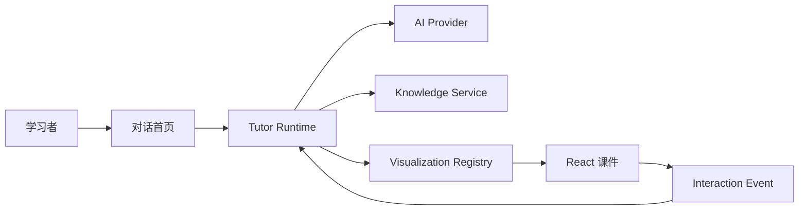
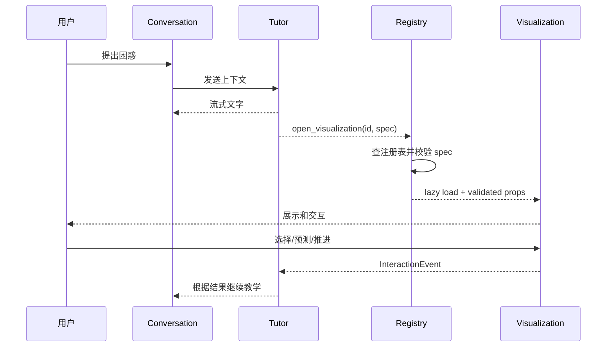

# Kaleidoscope 桌面架构

## 1. 架构目标

架构需要支持：

- Electron 安全隔离；
- AI 流式对话；
- 已有 React 课件复用；
- AI 通过结构化数据调整课件；
- 任意时刻只维护一个活动可视化页面；
- 对话与可视化之间的教学事件闭环；
- 与标准知识库稳定关联；
- 后续接入 RAG 和用户学习状态时不破坏当前边界。

## 2. 系统上下文



当前 MVP 可以暂时不接完整 Knowledge Service 和 RAG，但 contracts 与 ID 结构应保留
未来接入点。

## 3. Monorepo 结构

```text
Kaleidoscope/
├── apps/
│   └── desktop/
│       ├── src/
│       │   ├── main/
│       │   ├── preload/
│       │   └── renderer/
│       ├── electron.vite.config.ts
│       └── electron-builder.yml
├── packages/
│   ├── contracts/
│   ├── tutor-runtime/
│   ├── visualization-runtime/
│   ├── lessons/
│   │   └── call-stack/
│   └── ui/
├── docs/
├── AGENTS.md
├── package.json
├── pnpm-lock.yaml
└── pnpm-workspace.yaml
```

`call-stack-visualizer` 在迁移验收前保留为参考。

开发运行时使用 Node.js 24 LTS。workspace 建立时提交 `.node-version`，
`package.json#engines`、`package.json#packageManager` 与 `pnpm-lock.yaml`，并锁定
已验证兼容的 Electron、electron-vite、Vite 和测试工具版本。

## 4. Electron 分层

### Main

负责：

- BrowserWindow；
- Electron 安全配置；
- AI Provider 请求和凭据；
- 流式响应生命周期；
- 本地持久化；
- 受控知识资源读取；
- IPC handlers；
- 应用错误和日志。

Main 不负责 React 渲染或课件动画。

### Preload

负责：

- contextBridge；
- 固定领域 API；
- 类型化 IPC；
- 流式事件订阅；
- 取消订阅；
- 隐藏 ipcRenderer。

### Renderer

负责：

- 对话首页；
- 可视化容器；
- React 课件；
- Renderer 状态；
- 结构化课件交互；
- 安全 Markdown 展示；
- 加载、错误和降级 UI。

Renderer 不直接拥有 Provider 密钥、文件系统权限或动态代码执行能力。

## 5. Package 边界

### contracts

保存：

- IPC 通道；
- Zod 请求和响应；
- 流式事件类型；
- Conversation 类型；
- TutorCommand；
- VisualizationSessionSpec 外层协议；
- VisualizationInteractionEvent；
- 错误码；
- `window.kaleidoscope` API 类型。

### tutor-runtime

负责纯教学编排逻辑：

- 处理 AI 流式事件；
- 识别结构化 TutorCommand；
- 请求可视化；
- 接收课件交互事件；
- 把事件组织为后续 Tutor 上下文；
- 不依赖具体 React 课件。

AI Provider 网络请求在 main；可测试的事件归一化和状态转换可以放在
`tutor-runtime`。

### visualization-runtime

负责：

- 静态注册表；
- visualization ID 查找；
- session spec 校验；
- 页面补丁校验与应用；
- lazy loading；
- 默认场景；
- 错误边界协议；
- 交互事件协议；
- 单一活动可视化状态生命周期；
- session revision 管理。

### lessons/call-stack

负责：

- 现有调用栈课件；
- 静态步骤；
- 可调整参数 Schema；
- 课件专属 props；
- 交互事件；
- 回归测试。

### ui

保存对话、overlay、按钮、错误状态等通用 UI，不保存具体知识事实。

## 6. AI Provider 边界

Renderer 不直接持有 API Key。

建议流程：

```text
Renderer
→ preload.chat.send(validated request)
→ main AI Provider
→ main 解析/归一化 Provider stream
→ preload scoped events
→ Renderer
```

Provider 抽象至少区分：

- start；
- delta；
- structured command；
- complete；
- error；
- cancelled。

不要让 Renderer 依赖特定厂商原始流事件。

Provider 配置和凭据由 main 管理。日志不得记录密钥或完整敏感请求。

当前开发期路由：

```text
Renderer
→ typed IPC
→ main CodexTutorProvider
→ codex exec（空临时目录、read-only、ephemeral）
→ JSON Schema 输出
→ Zod 校验
→ TutorPlan / TutorCommand
```

本机 Codex 只作为开发期代答方案，不是 Renderer 能调用的通用 shell。Main 使用
固定参数启动已配置的 Codex CLI，不接受用户提供的命令、工作目录或 flags，不把
Main 的完整环境变量传给子进程，并显式禁用 shell、浏览器、网页搜索、MCP/插件和
多 Agent 工具。ChatGPT 网页只能人工转接，不抓取网页、复用 Cookie 或依赖页面
DOM。

正式商业 Provider 目标为 DeepSeek API。接入时必须继续复用同一流事件与
TutorCommand Schema；Renderer 不得感知 DeepSeek 原始事件或密钥。

## 7. TutorCommand

AI 文字和应用控制命令必须分开。

示例：

```ts
type TutorCommand =
  | {
      type: "open_visualization";
      visualizationId: string;
      spec: unknown;
    }
  | {
      type: "close_visualization";
    }
  | {
      type: "focus_visualization_step";
      stepId: string;
    }
  | {
      type: "patch_visualization";
      patch: unknown;
    };
```

TutorCommand 必须：

- 通过 Zod；
- 限制类型；
- 不能包含代码；
- 不能包含组件路径；
- 不能包含任意 URL；
- 不能直接改变文件或系统状态。

不支持的命令应被拒绝，并允许 Tutor 回退为文字讲解。

可视化命令遵循单实例规则：

- 没有活动页面时，`open_visualization` 创建 session；
- visualization ID 相同时，后续调整通过 `patch_visualization` 更新当前 session；
- visualization ID 不同时，`open_visualization` 原子替换当前 session；
- 不在后台同时保留多个可视化实例。

## 8. 可视化数据流



用户继续表达困惑时，Tutor 可以发送 `patch_visualization`。运行时先校验 session ID、
visualization ID、base revision 和补丁操作，再在同一个 React 页面中生成下一
revision；校验失败时保持当前页面不变并回退为文字说明。

## 9. 可视化注册表

```ts
interface VisualizationRegistration<TSpec, TEvent> {
  id: string;
  conceptIds: string[];
  version: number;
  status: "draft" | "review_pending" | "reviewed";
  specSchema: ZodType<TSpec>;
  defaultSpec: TSpec;
  load: () => Promise<VisualizationModule<TSpec, TEvent>>;
}
```

约束：

- 注册表由本地源码静态维护；
- AI 不能新增注册项；
- AI 不能提供 import 路径；
- spec 必须先校验后传给组件；
- Registry 必须支持默认场景；
- Registry 完整性有自动测试；
- reviewed 状态来自内容/教学审查，不由生成该组件的同一 Agent 自行宣布。

## 10. VisualizationSessionSpec

建议由通用外层和课件专属场景组成：

```ts
interface VisualizationSessionSpec<TScenario> {
  visualizationId: string;
  visualizationVersion: number;
  teachingGoal: string;
  initialStep?: number;
  tutorNotes?: TutorNoteInput[];
  pauses?: PredictionPause[];
  scenario: TScenario;
}
```

通用限制：

- `teachingGoal` 长度上限；
- notes 数量和单条长度上限；
- pauses 数量上限；
- initialStep 范围；
- version 必须兼容；
- `additionalProperties: false`；
- scenario 使用对应课件 Schema。

### 10.1 VisualizationPatch

```ts
interface VisualizationPatch {
  sessionId: string;
  visualizationId: string;
  baseRevision: number;
  operations: VisualizationPatchOperation[];
}
```

补丁操作必须是各课件预先声明的判别联合，只能调整安全数据和呈现状态，例如演示
数据、允许的步骤、当前强调、高亮、TutorNote、预测暂停、预定义视图与允许的布局
参数。不得接受任意属性路径，不得包含 React、JavaScript、HTML、CSS、组件路径或
可执行内容。

每个 session 从确定的 revision 开始。只有 `baseRevision` 等于当前 revision 的
补丁可以应用；成功后 revision 递增，过期、越界或未知操作保持当前页面不变。

## 11. 调用栈课件调整边界

第一版保持现有静态步骤。

AI 可在预定义范围内选择：

- 默认演示变体；
- 初始步骤；
- 强调阶段；
- TutorNote；
- 预测暂停点；
- 总结问题。

如果未来需要不同递归深度，应由开发阶段预先实现并审查安全的场景生成器，而不是
运行时执行 AI 生成代码。

代码面板保持只读。

## 12. 对话与可视化布局

```text
Renderer Root (relative)
├── ConversationPage
└── VisualizationWorkspace (single active absolute/fixed layer)
```

要求：

- ConversationPage 保持 mounted；
- 可视化打开不清空消息；
- 不丢失输入草稿；
- 不重置滚动位置；
- 支持关闭返回；
- 可按设计保留部分对话区域可见；
- overlay 阻止不必要的点击穿透；
- 焦点在打开/关闭时正确转移；
- Escape 行为明确；
- reduced-motion 生效；
- workspace 任意时刻只渲染一个活动可视化 session；
- 相同可视化在原页面更新，不创建标签页；
- 不同可视化原子替换当前页面。

这里没有终端或 PTY。

## 13. 对话状态模型

至少区分：

```text
conversationStore
├── conversationId
├── messages
├── draft
├── streamingState
└── lastError

visualizationStore
└── activeSession | null
    ├── sessionId
    ├── visualizationId
    ├── revision
    ├── validatedSpec
    ├── currentStep
    ├── status
    └── interactionHistory

appStore
├── currentRoute
└── UI preferences
```

AI Provider 请求生命周期由 main 管理；Renderer 保存可序列化的展示状态。

完整用户掌握度属于未来用户学习域，不能等同于临时 interactionHistory。

## 14. IPC 设计

建议领域 API：

```ts
interface ChatApi {
  send(input: ChatSendInput): Promise<ChatRequest>;
  cancel(input: ChatCancelInput): Promise<void>;
  onEvent(listener: (event: ChatStreamEvent) => void): () => void;
}

interface PersistenceApi {
  loadSession(): Promise<PersistedSession | null>;
  saveSession(input: PersistedSession): Promise<void>;
}
```

禁止通用 `send`、`invoke`、任意文件和任意代码执行 API。

所有 IPC handler 除了校验参数，还必须验证 sender 来自当前受信任的应用页面。
所有订阅必须可取消；窗口关闭或请求取消后停止流事件。

MVP 持久化使用 main 管理的版本化 JSON 文件，保存在 Electron 用户数据目录，并在
读取时经过 Zod 校验和版本迁移。当前不引入 SQLite；只有出现大量会话、全文检索或
复杂关系查询后再评估数据库。

## 15. 知识库接入

标准知识库：

```text
/Users/umico/Documents/ods-material/knowledge_base
```

当前 MVP 可先用本地最小教学上下文，不要求完成 RAG。

未来未知 concept：

```text
用户问题
→ RAG
→ concept_id
→ 标准知识对象
→ visualization_ids
→ Tutor 编排
```

已知 concept：

```text
concept_id
→ 标准知识对象
→ visualization_ids
→ Tutor 编排
```

Renderer 不直接扫描知识库文件系统。由 main 或受控本地服务读取和校验。

## 16. 安全模型

强制：

```ts
nodeIntegration: false
contextIsolation: true
sandbox: true
```

同时要求：

- 严格 CSP；
- 拦截导航和新窗口；
- 校验所有 IPC sender；
- 默认拒绝未明确允许的权限请求；
- 开发环境保留 electron-vite HMR，打包版本优先使用应用自有协议加载 Renderer；
- 不加载 AI 指定远程脚本；
- 不执行 AI 输出；
- 不用未清洗 HTML；
- Markdown 限制协议和标签；
- IPC 校验长度、枚举和 ID；
- Provider 凭据仅在 main；
- AI 输出只作为数据；
- 错误日志不泄露凭据。

## 17. 测试策略

### Vitest

- contracts；
- TutorCommand；
- session spec；
- registry；
- conversation reducer/store；
- visualization store；
- AI stream 归一化；
- 非法 spec 降级；
- interaction event。

### 组件测试

- 消息流；
- 输入框；
- 停止与重试；
- overlay 打开关闭；
- 对话保持 mounted；
- 调用栈课件迁移；
- reduced-motion；
- 错误边界。

### Playwright Electron

Playwright 的 Electron 自动化目前属于实验能力，因此只承担关键黄金流程和 smoke
test，不作为唯一安全验证手段。contracts、状态转换和安全策略仍由 Vitest、静态
检查及打包产物人工/自动 smoke test 共同覆盖。

- 应用启动；
- 发送消息；
- 流式回答；
- AI 打开可视化；
- 用户完成交互；
- 结果返回对话；
- 关闭可视化；
- 会话恢复；
- 安全 smoke test。

## 18. 架构不变量

- 首页是对话；
- 可视化基于已有组件；
- AI 只输出受约束数据；
- 用户不能编辑课件代码；
- 没有终端；
- Renderer 无 Node；
- 凭据只在 main；
- preload 只暴露最小 API；
- IPC 和 AI spec 全部校验；
- IPC sender 全部校验；
- 对话与可视化状态分离；
- 可视化关闭后原会话保持；
- 知识事实不包含用户状态；
- 可视化代码不写入知识库；
- 未审查资源不能标记 reviewed；
- Electron Fuses 在发布打包阶段完成配置与验证。
